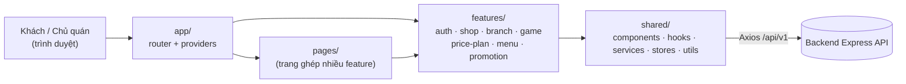
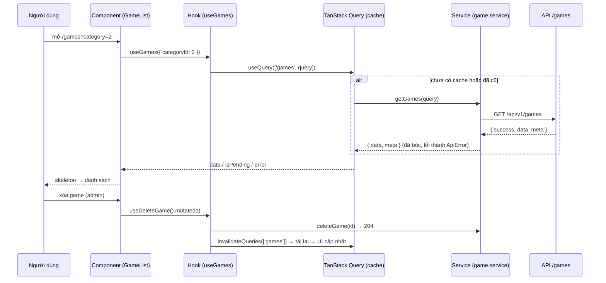
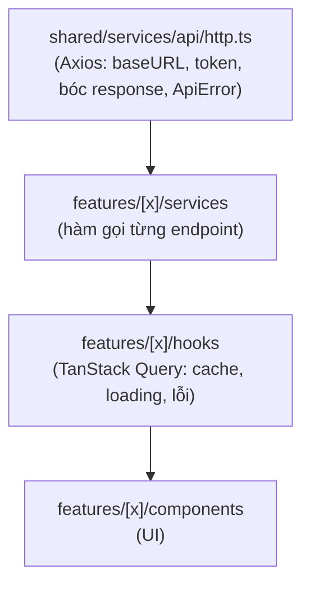

# ARCHITECTURE.md — Frontend Fight Station

Kiến trúc giao diện cho website quán PS5: khách xem game, bảng giá, menu, chi nhánh, khuyến mãi; chủ quán đăng nhập trang quản trị để thêm/sửa/xóa. Dữ liệu và quyền xem `DATABASE.md`, `API_SPEC.md`; quy tắc code xem `PROJECT-RULES.md` (FE).

## 1. Tổng quan

**Kiến trúc theo feature**: mỗi tính năng (game, menu, bảng giá...) là một thư mục tự đóng gói gồm component, hook, service, type, trang quản trị, tên trùng feature của backend nên dễ lần theo từ bảng DB → endpoint → màn hình. Thêm tính năng mới (vd `event`) chỉ thêm một thư mục và một dòng route.

**Lý do chọn tech stack**
| Công nghệ | Lý do |
|---|---|
| React 19 + TypeScript | Phổ biến, nhiều tài liệu; type bám sát `API_SPEC.md`, bắt lỗi sai trường từ lúc build |
| Vite | Build/dev nhanh, cấu hình ít, đủ cho site nhỏ; backend đã tách riêng nên không cần framework full-stack |
| TanStack Query | Cache, tải lại, trạng thái loading/lỗi của dữ liệu API; khớp `Cache-Control: max-age=60` của backend |
| Zustand | Store nhỏ cho đăng nhập và UI toàn cục, không cần boilerplate |
| Tailwind CSS | Token màu cam dùng thống nhất; không phải đặt tên class |
| React Hook Form + Zod | Form quản trị có nhiều trường; schema Zod khớp luật validate của API |

## 2. Cấu trúc thư mục
```
src/
├── app/                        # khởi tạo ứng dụng
│   ├── main.tsx                # entry point: render <App />, nạp styles
│   ├── App.tsx                 # <AppProviders><RouterProvider /></AppProviders>
│   ├── providers.tsx           # QueryClientProvider, ErrorBoundary, Toaster, nghe sự kiện auth:expired
│   └── routes.tsx              # ghép layout + route của từng feature + trang trong src/pages
├── pages/                      # CHỈ trang ghép ≥ 2 feature: HomePage.tsx, GamesPage.tsx
├── shared/                     # dùng chung, KHÔNG import features
│   ├── components/             # ui/ (Button, Modal, Skeleton, Toast), layout/ (PublicLayout, AdminLayout), ErrorBoundary
│   ├── hooks/                  # useDebounce, useDocumentTitle
│   ├── services/api/           # http.ts (Axios), api-error.ts (ApiError)
│   ├── stores/                 # auth.store.ts (token, admin), ui.store.ts (sidebar admin)
│   ├── types/                  # api.types.ts (Paged<T>, Meta, ApiErrorBody)
│   └── utils/                  # formatVnd, formatDate, event-bus
├── features/                   # mỗi thư mục = một tính năng, xem mục 3
│   ├── auth/                   # đăng nhập, đổi mật khẩu, RequireAuth      ← /auth/*
│   ├── shop/                   # thông tin quán, liên hệ, footer           ← /shop
│   ├── branch/                 # chi nhánh                                  ← /branches
│   ├── game/                   # game, thể loại, lọc                        ← /games, /game-categories
│   ├── price-plan/             # bảng giá theo giờ                          ← /price-plans
│   ├── menu/                   # nhóm menu + món                            ← /menu, /menu-items, /menu-categories
│   └── promotion/              # khuyến mãi / sự kiện                       ← /promotions
├── assets/                     # logo, ảnh nền, font (ảnh poster game lấy từ URL của API, không để ở đây)
└── styles/                     # index.css (Tailwind layers), tokens màu cam, font
```
Ngoài `src/`: `index.html`, `vite.config.ts`, `.env.example` (Tailwind v4 không có `tailwind.config`; token màu khai báo bằng `@theme` trong `src/styles/index.css`).

Điều chỉnh theo React/Vite: thêm `pages/` ở cấp cao để ghép nhiều feature (feature không được import nhau). `auth.store.ts` nằm ở `shared/stores` vì `http.ts` (shared) cần đọc token mà shared không được import `features`.

## 3. Giải phẫu một feature
```
features/game/
├── components/       # GameCard, GameList, GameFilters, GameForm, GameListSkeleton (+ test, cạnh file)
├── hooks/            # useGames, useGame, useCreateGame, useUpdateGame, useDeleteGame, useGameCategories
├── services/         # game.service.ts: getGames, createGame, deleteGame... (gọi qua shared http)
├── stores/           # (không có: game chưa cần state toàn cục)
├── types/            # game.types.ts (Game, GameQuery), game.schema.ts (Zod + GameInput)
├── utils/            # groupByCategory.ts, accentClass.ts (accentColor → class Tailwind)
├── pages/            # AdminGamesPage.tsx (trang chỉ dùng feature này)
├── routes.tsx        # RouteObject[] của feature (lazy)
├── index.ts          # public export: GameList, GameCard, gameRoutes, kiểu cần thiết
└── context.md        # mục đích, endpoint dùng, thứ export, phụ thuộc
```
- **Trang chỉ dùng một feature** (admin game, trang menu, trang bảng giá) nằm trong `features/[x]/pages/`. **Trang ghép ≥ 2 feature** (trang chủ, trang game có lọc theo chi nhánh) nằm ở `src/pages/`.
- Thư mục nào chưa cần thì không tạo (feature `shop` không có `stores/`).

## 4. Luồng dữ liệu

Hành động người dùng → Component → Hook → Service → API. Dữ liệu từ server nằm trong cache của TanStack Query; **store chỉ dùng cho auth và UI toàn cục**, không chép dữ liệu API vào store.

## 5. Giao tiếp giữa các feature
| Cách | Trường hợp sử dụng | Ví dụ ở dự án |
|---|---|---|
| **URL / Router** (mặc định) | Truyền bộ lọc, chọn đối tượng giữa các phần giao diện | `/games?branch=1&category=2&q=tekken`: `BranchPicker` ghi URL, `GameList` đọc URL |
| **Global store** (hạn chế) | Dữ liệu mọi nơi đều cần | `auth.store` (token, role), `ui.store` (sidebar admin) |
| **Event emitter** (hiếm) | Hành động tách rời, một chiều | `http.ts` phát `auth:expired` → `providers.tsx` xóa token và chuyển về `/admin/login` |
| **Props ở `pages/`** | Ghép nhiều feature vào một trang | `HomePage` đặt `GameList`, `PricePlanList`, `BranchList` cạnh nhau |

**Bị cấm**: import file nội bộ của feature khác (`@/features/branch/hooks/useBranches`). Chỉ import qua `index.ts`. ESLint `no-restricted-imports` chặn `@/features/*/*`, và `shared/` không bao giờ import `features/`.

## 6. Cấu trúc routing
| Nhóm | Path | Trang | Nơi khai báo | Tải |
|---|---|---|---|---|
| Public | `/` | HomePage (hero, game, bảng giá, menu, chi nhánh, khuyến mãi) | `src/pages` | eager |
| Public | `/games` | GamesPage (lọc thể loại, chi nhánh, tìm tên) | `src/pages` | lazy |
| Public | `/menu`, `/pricing`, `/branches`, `/promotions` | trang từng feature | `features/*/pages` | lazy |
| Public | `/admin/login` | AdminLoginPage | `features/auth` | lazy |
| Protected (Admin) | `/admin/games`, `/admin/menu`, `/admin/promotions`, `/admin/account` | trang quản trị (`Admin*Page`) | `features/*/pages` | lazy (chunk riêng) |
| Protected (Owner) | `/admin/shop`, `/admin/branches`, `/admin/price-plans` | trang quản trị (`Admin*Page`) | `features/*/pages` | lazy (chunk riêng) |
| Khác | `*` | NotFoundPage | `shared/components` | eager |

```tsx
// features/game/routes.tsx: mỗi feature tự khai báo route của mình
export const gameRoutes: RouteObject[] = [
  { path: 'admin/games', lazy: () => import('./pages/AdminGamesPage') },
];
// app/routes.tsx: chỉ ghép
{ element: <PublicLayout />, children: [{ index: true, element: <HomePage /> }, ...publicRoutes] },
{ path: 'admin', element: <RequireAuth><AdminLayout /></RequireAuth>, children: [...gameRoutes, ...menuRoutes,
  { element: <RequireRole role="owner" />, children: [...branchRoutes, ...pricePlanRoutes, ...shopRoutes] }] },
```
- `RequireAuth`: không có token thì chuyển `/admin/login` (kèm `?next=`). `RequireRole`: staff vào trang owner thì hiện "không đủ quyền". Chỉ là che giao diện, quyền thật do API (`AUTH_005`).
- **Lazy loading**: mọi trang trừ HomePage tải theo route; mã quản trị tách chunk riêng nên khách không tải. Hover/focus vào link có thể preload chunk.

## 7. Chiến lược quản lý state
| Loại state | Vị trí | Ví dụ |
|---|---|---|
| Server state | TanStack Query (`staleTime` 60s, khớp cache backend) | danh sách game, menu, chi nhánh |
| Global UI | `shared/stores/ui.store.ts` (Zustand) | thu gọn sidebar quản trị |
| Auth | `shared/stores/auth.store.ts` (Zustand `persist`, key `fs-auth`) | `accessToken`, `admin { id, username, role }` |
| Feature state | `features/[x]/stores/` (chỉ khi cần) | bản nháp form dài (hiện chưa có) |
| URL state | Router (`useSearchParams`) | bộ lọc, từ khóa tìm kiếm, trang hiện tại |
| Local UI | `useState` trong component | mở/đóng modal, tab đang chọn |

Query key theo mẫu `['games', query]`, `['game', id]`, `['menu']`. Sau mutation phải `invalidateQueries` đúng key gốc. Token lưu `localStorage` (sống 1 ngày theo API); chấp nhận vì chỉ có tài khoản quản trị, nên giữ CSP chặt và không chèn HTML thô.

## 8. Tầng API

```ts
// shared/services/api/http.ts (rút gọn)
const client = axios.create({ baseURL: import.meta.env.VITE_API_URL });   // .../api/v1
client.interceptors.request.use((c) => {                                  // gắn token cho request quản trị
  const token = useAuthStore.getState().token;
  if (token) c.headers.Authorization = `Bearer ${token}`;
  return c;
});
client.interceptors.response.use(
  (r) => r.data,                                                          // { success, data, meta }
  (e) => {
    const body = e.response?.data?.error;                                 // { code, message, details }
    if (['AUTH_002', 'AUTH_003'].includes(body?.code)) eventBus.emit('auth:expired');
    throw new ApiError(body?.code ?? 'NETWORK_ERROR', body?.message ?? 'Không kết nối được máy chủ', body?.details);
  },
);
```
Service chỉ gọi `http` và trả `{ data, meta }`. Hook không biết URL. Component không biết Axios. Lỗi luôn là `ApiError` (có `code`), giao diện báo theo `ERROR_MESSAGES[code]`.

## 9. Shared vs Features
| Shared | Features |
|---|---|
| UI component không biết nghiệp vụ: `Button`, `Modal`, `Skeleton`, `PublicLayout` | Component của feature: `GameCard`, `MenuItemRow`, `GameForm` |
| API client (`http.ts`), `ApiError` | Service của feature: `game.service.ts` |
| Hook toàn cục: `useDebounce`, `useDocumentTitle` | Hook của feature: `useGames`, `useDeleteGame` |
| Utility: `formatVnd`, `formatVndShort`, `formatDate`, `eventBus` | Utility của feature: `groupByCategory`, `accentClass` |
| Store: `auth.store`, `ui.store` | Store của feature (nếu có) |

Quy tắc nhanh: chỉ một feature dùng thì để trong feature; từ **2 feature** trở lên mới chuyển vào `shared/`; thứ gì nhắc đến game, menu, giá thì không thuộc `shared/`.

## 10. Bổ sung riêng cho React + Vite
- **Router**: React Router (data router, `createBrowserRouter`), `lazy` theo route. Hosting phải trả `index.html` cho mọi đường dẫn (SPA fallback).
- **Vite**: alias `@/` → `src/`; dev proxy `/api` → backend (cổng = `PORT` trong `backend/.env`, hiện `8000`) để khỏi lỗi CORS. Biến môi trường chỉ có `VITE_API_URL` (công khai, không để secret). `manualChunks` chỉ tách `vendor`; mã quản trị tách nhờ **lazy route** (nhánh `/admin` → `app/AdminRoot.tsx` và mọi trang `Admin*` đều lazy). Không gom admin bằng `manualChunks`: Rolldown kéo luôn code dùng chung vào chunk đó khiến trang công khai cũng phải tải.
- **SSR/SSG**: không dùng. Dữ liệu ít, trang công khai tải nhanh nhờ cache. Cần SEO mạnh hơn thì prerender các trang công khai lúc build hoặc chuyển sang Next.js, phần `features/` giữ nguyên.
- **Provider** (trong `providers.tsx`, từ ngoài vào trong): `ErrorBoundary` → `QueryClientProvider` → `Toaster` → `RouterProvider`.
- **Hiệu năng**: ảnh poster `loading="lazy"` và có kích thước cố định để không nhảy layout; ô tìm kiếm debounce 300ms rồi mới ghi vào URL; danh sách công khai dùng `limit=100` để lọc nhanh, không phân trang phía client.
- **Giao diện (theme neon cam)**: lấy từ bản prototype, khai báo một chỗ trong `src/styles/index.css`.
  - Màu: `brand-*` (cam neon, `brand-500 = #ff6a00`), `neon-red`, `neon-amber`, `neon-gold`; nền `void` (trang), `dark` (footer), `card` (thẻ); chữ `ink` (chính), `muted` (phụ). Component chỉ dùng class sinh từ token (`bg-card`, `text-muted`...), không hardcode mã màu.
  - Font (Google Fonts, link trong `index.html`): `font-sans` = Chakra Petch (chữ chính và tiêu đề, có tiếng Việt), `font-mono` = JetBrains Mono (nhãn nhỏ kiểu `// LOCATIONS`), `font-display` = Orbitron **chỉ cho logo và con số** (Orbitron không có chữ tiếng Việt có dấu).
  - Utility riêng: `text-glow`, `text-glow-strong` (chữ phát sáng), `text-outline` (chữ rỗng viền cam), `clip-skew` / `clip-skew-lg` (nút vát góc), `clip-corner` (khung cắt 2 góc); animation `animate-glitch`, `animate-float` (tự tắt khi `prefers-reduced-motion`); `neon-backdrop` (nền lưới + vạch quét, gắn ở `PublicLayout`, trang quản trị không dùng).
  - Khung trang khách: `PublicLayout` → `PublicHeader` (menu ngang từ `md`, nút ☰ trên điện thoại, nút nổi bật `cta`); tiêu đề mục dùng `shared/components/ui/SectionHeading` (`tag`, `title`, `accent`, mô tả).
